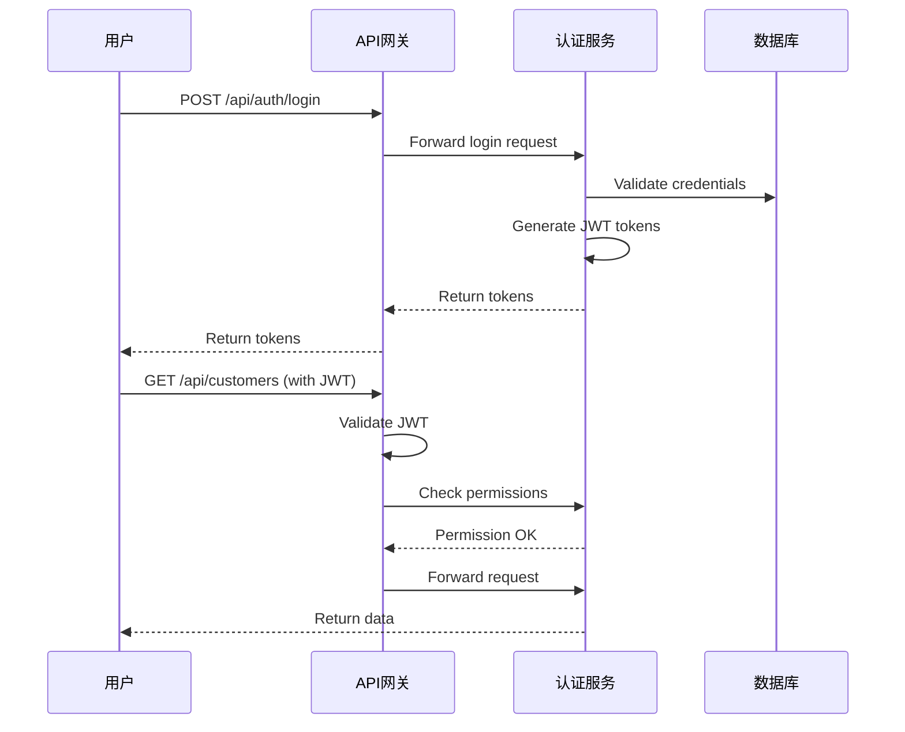

# 11. Backend Architecture

## 11.1 Service Architecture

### Controller/Route Organization

```
cnc-erp-system/src/main/java/com/cnc/erp/
├── controller/          # REST Controller
│   ├── AuthController.java
│   ├── CustomerController.java
│   ├── QuotationController.java
│   └── ...
├── service/            # 业务逻辑
│   ├── CustomerService.java
│   ├── QuotationService.java
│   └── ...
├── repository/          # 数据访问
│   ├── CustomerRepository.java
│   ├── QuotationRepository.java
│   └── ...
├── entity/              # JPA Entity
│   ├── Customer.java
│   ├── Quotation.java
│   └── ...
├── dto/                 # 数据传输对象
│   ├── CustomerDTO.java
│   └── ...
├── config/              # 配置类
│   └── SecurityConfig.java
└── CncErpApplication.java
```

### Controller Template

```java
@RestController
@RequestMapping("/api/customers")
@RequiredArgsConstructor
@Slf4j
public class CustomerController {

    private final CustomerService customerService;

    @GetMapping
    public Result<Page<CustomerDTO>> list(
            @RequestParam(defaultValue = "1") Integer page,
            @RequestParam(defaultValue = "20") Integer pageSize,
            @RequestParam(required = false) String keyword) {
        return Result.success(customerService.list(page, pageSize, keyword));
    }

    @PostMapping
    public Result<CustomerDTO> create(@Validated @RequestBody CustomerCreateDTO dto) {
        return Result.success(customerService.create(dto));
    }

    @GetMapping("/{id}")
    public Result<CustomerDTO> get(@PathVariable String id) {
        return Result.success(customerService.get(id));
    }
}
```

---

## 11.2 Database Architecture

### Schema Design

- 使用MyBatis-Plus作为ORM框架
- Entity类使用MyBatis-Plus注解配置映射关系
- 支持逻辑删除（deleted_at字段）
- UUID作为主键策略
- 时间戳自动维护（created_at, updated_at）

### Data Access Layer

```java
@Repository
@RequiredArgsConstructor
public class CustomerRepository {

    private final CustomerMapper customerMapper;

    public Page<Customer> list(int page, int pageSize, String keyword) {
        LambdaQueryWrapper<Customer> wrapper = new LambdaQueryWrapper<>();
        if (StringUtils.isNotBlank(keyword)) {
            wrapper.like(Customer::getName, keyword)
                   .or()
                   .like(Customer::getCode, keyword);
        }
        wrapper.orderByDesc(Customer::getCreatedAt);
        return customerMapper.selectPage(new Page<>(page, pageSize), wrapper);
    }
}
```

---

## 11.3 Authentication and Authorization

### Auth Flow



### Middleware/Guards

```java
@Configuration
@EnableWebSecurity
public class SecurityConfig {

    @Bean
    public SecurityFilterChain filterChain(HttpSecurity http) throws Exception {
        http
            .csrf().disable()
            .authorizeHttpRequests(auth -> auth
                .antMatchers("/api/auth/**").permitAll()
                .anyRequest().authenticated()
            )
            .addFilterBefore(jwtAuthenticationFilter(), UsernamePasswordAuthenticationFilter.class);
        return http.build();
    }
}
```

---

## 11.4 MinIO Integration

### MinIO配置

```yaml
# application.yml
minio:
  endpoint: http://localhost:9000
  access-key: minioadmin
  secret-key: minioadmin
  buckets:
    drawings: drawings
    attachments: attachments
    temp: temp
```

### MinIO Service

```java
@Service
@RequiredArgsConstructor
@Slf4j
public class MinioFileService {

    private final MinioClient minioClient;

    @Value("${minio.buckets.drawings}")
    private String drawingsBucket;

    public String uploadFile(MultipartFile file, String bucket) {
        String objectKey = generateObjectKey(file.getOriginalFilename());
        try {
            PutObjectArgs args = PutObjectArgs.builder()
                .bucket(bucket)
                .object(objectKey)
                .stream(file.getInputStream(), file.getSize(), -1)
                .contentType(file.getContentType())
                .build();
            minioClient.putObject(args);
            return objectKey;
        } catch (Exception e) {
            log.error("Failed to upload file", e);
            throw new BusinessException("FILE_UPLOAD_FAILED", "文件上传失败");
        }
    }

    public String getPresignedUrl(String bucket, String objectKey) {
        try {
            return minioClient.getPresignedObjectUrl(
                GetPresignedObjectUrlArgs.builder()
                    .bucket(bucket)
                    .object(objectKey)
                    .expiry(3600)
                    .build()
            );
        } catch (Exception e) {
            log.error("Failed to generate presigned URL", e);
            throw new BusinessException("FILE_URL_GENERATE_FAILED", "文件URL生成失败");
        }
    }

    private String generateObjectKey(String originalFilename) {
        return String.format("%s/%s_%s",
            LocalDate.now().format(DateTimeFormatter.ISO_DATE),
            UUID.randomUUID().toString().substring(0, 8),
            originalFilename);
    }
}
```

---
