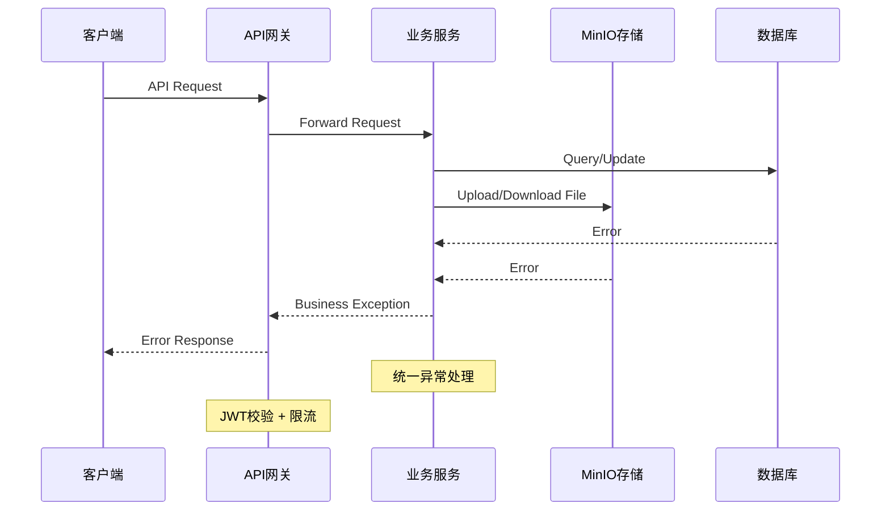

# 18. Error Handling Strategy

## 18.1 Error Flow



## 18.2 Error Response Format

```typescript
interface ApiError {
  error: {
    code: string;        // 业务错误码
    message: string;     // 用户可读消息
    details?: Record<string, any>;  // 详细信息
    timestamp: string;   // 时间戳
    requestId: string;  // 请求追踪ID
  };
}
```

## 18.3 Frontend Error Handling

```typescript
// services/api.ts
api.interceptors.response.use(
  response => response,
  error => {
    const errorResponse = error.response?.data
    if (errorResponse?.error?.code) {
      // 业务错误，显示错误消息
      ElMessage.error(errorResponse.error.message)
    } else {
      // 系统错误，显示通用消息
      ElMessage.error('网络错误，请稍后重试')
    }
    return Promise.reject(error)
  }
)
```

## 18.4 Backend Error Handling

```java
@RestControllerAdvice
public class GlobalExceptionHandler {

    @ExceptionHandler(BusinessException.class)
    public Result<?> handleBusinessException(BusinessException e) {
        log.warn("Business error: {}", e.getMessage());
        return Result.error(e.getCode(), e.getMessage());
    }

    @ExceptionHandler(MinioException.class)
    public Result<?> handleMinioException(MinioException e) {
        log.error("MinIO error", e);
        return Result.error("FILE_ERROR", "文件服务异常，请稍后重试");
    }

    @ExceptionHandler(Exception.class)
    public Result<?> handleException(Exception e) {
        log.error("System error", e);
        return Result.error("SYSTEM_ERROR", "系统错误，请稍后重试");
    }
}
```

---
