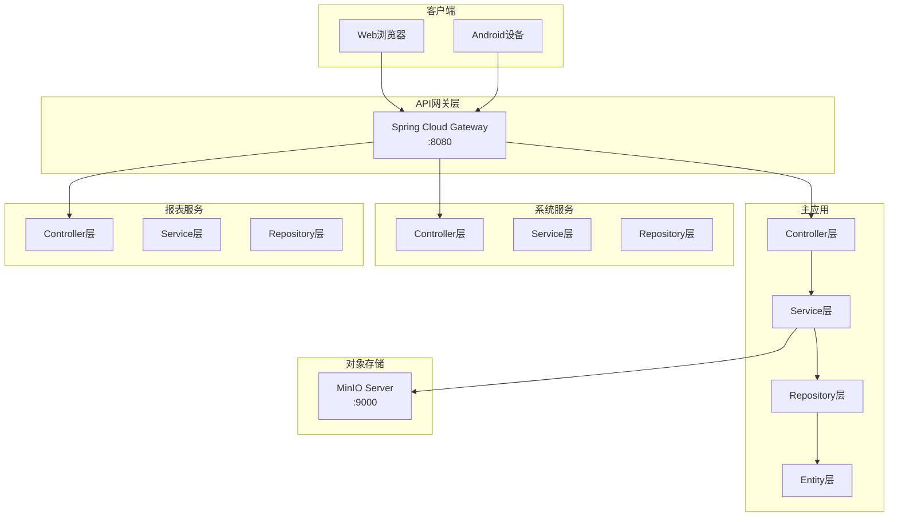

# 6. Components

## 6.1 Component List

### API Gateway (cnc-erp-system-gateway)

**Responsibility:** 统一路由、认证鉴权、日志记录、跨域处理

**Key Interfaces:**
- `/api/auth/*` → 认证服务
- `/api/sys/*` → 系统服务
- `/api/biz/*` → 主应用

**Dependencies:** Redis (Session存储), MySQL (路由配置)

**Technology Stack:** Spring Cloud Gateway 2021.0.x, Redis 7.2.x

---

### Main Application (cnc-erp-system)

**Responsibility:** 核心业务逻辑实现（客户/报价/订单/生产/仓储/委外/品质/财务/人事）

**Key Interfaces:**
- 业务Service层
- Repository数据访问层
- 事件发布接口

**Dependencies:** MySQL, Redis, MinIO, XXL-JOB

**Technology Stack:** Spring Boot 2.7.18, MyBatis-Plus 3.5.x, AWS S3 SDK 2.x (MinIO兼容)

---

### System Service (cnc-erp-system-service-sys)

**Responsibility:** 用户管理、权限控制、工作流引擎、数据字典

**Key Interfaces:**
- `UserService`, `RoleService`, `PermissionService`
- `WorkflowService`, `DictionaryService`

**Dependencies:** MySQL, Redis

**Technology Stack:** Spring Boot 2.7.18, Spring Security 5.7.x

---

### Report Service (cnc-erp-system-service-report)

**Responsibility:** 产值统计、交期分析、库存报表、财务报表

**Key Interfaces:**
- `ProductionReportService`, `DeliveryReportService`
- `InventoryReportService`, `FinancialReportService`

**Dependencies:** MySQL, Redis

**Technology Stack:** Spring Boot 2.7.18, MyBatis-Plus 3.5.x

---

### Frontend Web (cnc-erp-web)

**Responsibility:** Web端用户界面，响应式设计，支持桌面和移动浏览器

**Key Interfaces:**
- Vue Router (路由管理)
- Pinia Store (状态管理)
- API Client Service (HTTP请求封装)

**Dependencies:** Vue 3.4.x, Element Plus 2.5.x, Vite 5.x

**Technology Stack:** Vue 3.4.x, TypeScript 5.x, Element Plus 2.5.x, Pinia 2.1.x, Tailwind CSS 3.4.x, Vite 5.x

---

### Android APP (cnc-erp-android)

**Responsibility:** 移动端用户界面，扫码功能为核心

**Key Interfaces:**
- Jetpack Compose UI
- CameraX (扫码功能)
- Retrofit (API调用)

**Dependencies:** Kotlin 1.9.x, Jetpack Compose 1.5.x, CameraX 1.3.x

**Technology Stack:** Kotlin 1.9.x, Jetpack Compose 1.5.x, CameraX 1.3.x, Hilt 2.48.x, Retrofit 2.9.x

---

## 6.2 Component Diagrams

---
