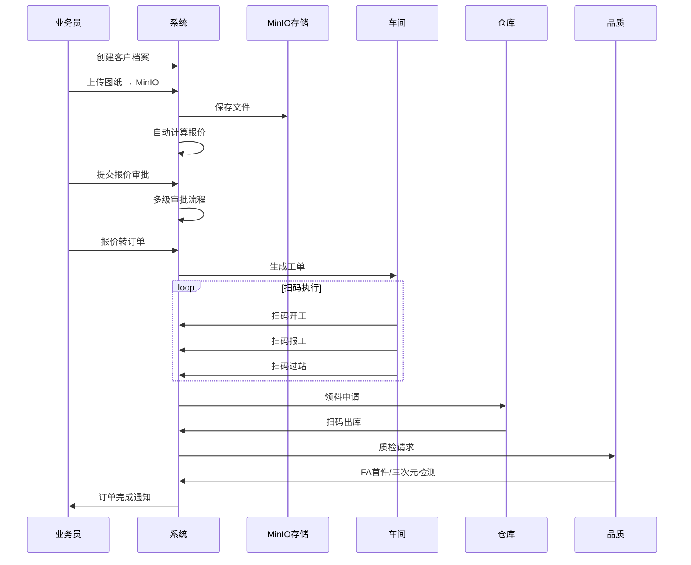

# 8. Core Workflows

```mermaid
sequenceDiagram
    participant Sales as 业务员
    participant System as 系统
    participant Storage as MinIO存储
    participant Workshop as 车间
    participant WH as 仓库
    participant QA as 品质

    Sales->>System: 创建客户档案
    Sales->>System: 上传图纸 → MinIO
    System->>Storage: 保存文件
    System->>System: 自动计算报价
    Sales->>System: 提交报价审批
    System->>System: 多级审批流程
    Sales->>System: 报价转订单
    System->>Workshop: 生成工单

    loop 扫码执行
        Workshop->>System: 扫码开工
        Workshop->>System: 扫码报工
        Workshop->>System: 扫码过站
    end

    System->>WH: 领料申请
    WH->>System: 扫码出库

    System->>QA: 质检请求
    QA->>System: FA首件/三次元检测

    System->>Sales: 订单完成通知
```

---
