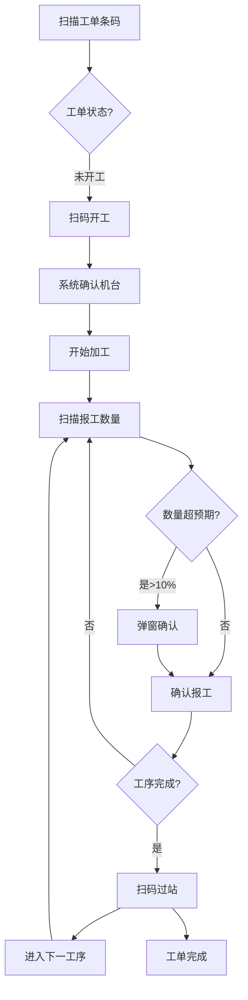
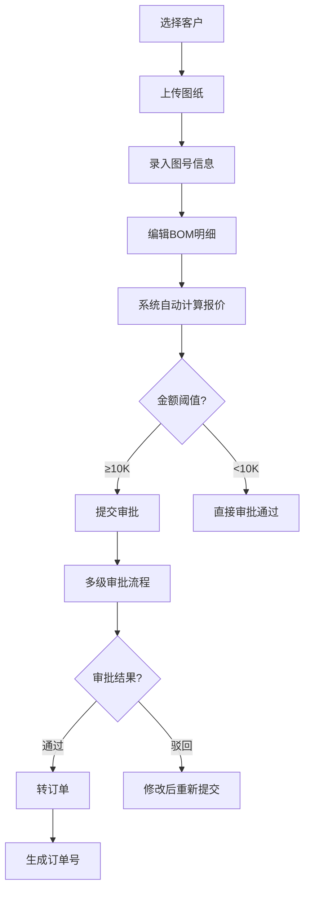
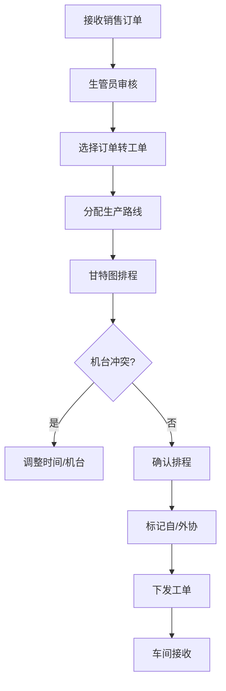

# CNC加工厂ERP系统 UI/UX Specification

---

## 文档信息

| 项目名称 | CNC加工厂ERP系统 |
|---------|-----------------|
| 文档版本 | V1.0 |
| 创建日期 | 2026-06-02 |
| 状态 | 初稿 |
| 创建人 | 计成（UX专家） |

---

## 1. Introduction

This document defines the user experience goals, information architecture, user flows, and visual design specifications for CNC加工厂ERP系统's user interface. It serves as the foundation for visual design and frontend development, ensuring a cohesive and user-centered experience.

### 1.1 UX Goals & Principles

#### Target User Personas

| Persona | Description |
|---------|-------------|
| **车间操作工** | 35岁以下，初中/中专学历，熟练操作智能手机。核心场景：扫码开工/报工/过站，3步内完成，信息一目了然。 |
| **生管员** | 生产计划与调度，需清晰掌握工单状态、机台负荷、甘特图排程。 |
| **业务员/工程师** | 28-45岁，大专以上学历。客户图纸管理、报价录入、工艺复用。 |
| **管理员** | 系统配置、权限管理，需全局掌控。 |

#### Usability Goals

| Goal | Metric |
|------|--------|
| 扫码报工完成率 | ≥95% 的工单通过扫码完成开工/报工/过站 |
| 核心操作路径深度 | 扫码类操作 ≤3步，信息类操作 ≤5步 |
| 报工及时率 | 2小时内报工比例 ≥90% |
| 系统响应时间 | 普通查询 ≤2秒，复杂报表 ≤10秒 |
| 移动端单手操作率 | APP端 ≥80% 操作可单手完成 |

#### Design Principles

1. **扫码优先** — 核心操作以扫码为入口，减少手工录入
2. **信息密度可控** — 卡片式展示关键数据，支持展开详情
3. **即时反馈** — 每次操作有明确的状态提示（成功/失败/确认）
4. **渐进式披露** — 先展示必要信息，细节按需展开
5. **无障碍设计** — WCAG AA标准，触控目标 ≥44px，颜色对比度 ≥4.5:1

### 1.2 Change Log

| Date | Version | Description | Author |
|------|---------|-------------|--------|
| 2026-06-02 | V1.0 | 初稿生成 | 计成 |

---

## 2. Information Architecture (IA)

### 2.1 Site Map / Screen Inventory

```mermaid
graph TD
    %% 登录层
    Login[登录页] --> Home[首页/仪表盘]

    %% 核心模块
    Home --> Customer[客户管理]
    Home --> Quotation[报价管理]
    Home --> Order[订单管理]
    Home --> Drawing[图纸管理]
    Home --> Production[生产排产]
    Home --> Workshop[车间执行]
    Home --> Warehouse[仓储管理]
    Home --> Quality[品质管理]
    Home --> Outsourcing[委外管理]
    Home --> Report[报表看板]
    Home --> System[系统管理]

    %% 子模块 - 客户管理
    Customer --> CustomerList[客户列表]
    Customer --> CustomerDetail[客户详情]
    Customer --> ContactList[联系人管理]

    %% 子模块 - 报价管理
    Quotation --> QuotationList[报价单列表]
    Quotation --> QuotationCreate[报价单新增/编辑]
    Quotation --> QuotationDetail[报价单详情]
    Quotation --> BOMEdit[BOM编辑]

    %% 子模块 - 订单管理
    Order --> OrderList[订单列表]
    Order --> OrderDetail[订单详情]
    Order --> OrderProgress[订单进度跟踪]

    %% 子模块 - 图纸管理
    Drawing --> DrawingList[图纸列表]
    Drawing --> DrawingPreview[图纸预览]
    Drawing --> DrawingVersion[版本管理]
    Drawing --> DrawingPrint[打印随单]

    %% 子模块 - 生产排产
    Production --> WorkOrderList[工单列表]
    Production --> GanttChart[甘特图排程]
    Production --> MachineSchedule[机台排班]
    Production --> RouteDef[工序路线定义]

    %% 子模块 - 车间执行
    Workshop --> ScanStart[扫码开工]
    Workshop --> ScanReport[扫码报工]
    Workshop --> ScanTransfer[扫码过站]
    Workshop --> MaterialIssue[领料管理]
    Workshop --> WorkOrderTrack[工单状态追踪]

    %% 子模块 - 仓储管理
    Warehouse --> StockIn[扫码入库]
    Warehouse --> StockOut[扫码出库]
    Warehouse --> InventoryQuery[库存查询]
    Warehouse --> InventoryList[库存列表]

    %% 子模块 - 品质管理
    Quality --> IQCList[来料检验]
    Quality --> FAIList[FA首件确认]
    Quality --> CMMList[三次元检测]
    Quality --> ReportList[质检报告]

    %% 子模块 - 委外管理
    Outsourcing --> SupplierList[外协厂商]
    Outsourcing --> OutsourceOrder[委外下单]
    Outsourcing --> OutsourceTrack[委外跟踪]
    Outsourcing --> Reconciliation[委外对账]

    %% 子模块 - 报表看板
    Report --> ProductionValue[产值看板]
    Report --> DeliveryDashboard[交付看板]
    Report --> InventoryDashboard[库存看板]
    Report --> FinancialReport[财务报表]

    %% 子模块 - 系统管理
    System --> UserManagement[用户管理]
    System --> RolePermission[角色权限]
    System --> WorkflowConfig[工作流配置]
    System --> DataDictionary[数据字典]
    System --> AuditLog[操作日志]
```



### 2.2 Navigation Structure

**Primary Navigation:** 左侧边栏（桌面端）/ 底部导航栏（移动端 APP）

**Module Order (按业务流程优先级):**
1. 首页仪表盘
2. 客户管理
3. 报价管理
4. 订单管理
5. 图纸管理
6. 生产排产
7. 车间执行（APP端 P0）
8. 仓储管理
9. 品质管理
10. 委外管理
11. 报表看板
12. 系统管理

**Breadcrumb Strategy:** `/一级模块 / 二级模块 / 详情页`，点击可跳转

**Quick Actions (Header):**
- 全局搜索（支持快捷键 `/` 唤起）
- 消息通知
- 用户头像/退出

---

## 3. User Flows

### 3.1 扫码报工流程 (Core Flow)



**Entry Points:** 车间 APP 首页、工单列表、扫码入口图标
**Success Criteria:** 操作工在 3 步内完成报工，系统实时更新工单状态

### 3.2 报价转订单流程



### 3.3 工单排产流程



---

## 4. Wireframes & Mockups

### 4.1 Design Files

**Primary Design Tool:** Figma
**Design File Link:** (待甲方提供 Figma 项目链接)
**UI Component Library:** shadcn/ui + 自定义 CNC 行业组件

### 4.2 Key Screen Layouts

#### Dashboard / 首页 (Web)

- **Purpose:** 展示关键业务指标（产值、交付、逾期、库存），快速访问核心模块
- **Key Elements:**
  - 顶部 KPI 卡片区（4-6个指标卡，等宽网格）
  - 中部甘特图/工单进度区域
  - 底部快捷操作入口（扫码开工、最新工单、待处理事项）
- **Layout:** 12列网格，KPI卡片各占3列，图表区占12列
- **Interaction Notes:** 卡片hover放大阴影，点击进入详情；图表支持时间范围切换

#### 扫码报工 (Mobile APP)

- **Purpose:** 操作工快速完成扫码开工、报工、过站
- **Key Elements:**
  - 顶部扫码按钮（大圆形，霓虹边框，60%屏幕宽度）
  - 当前工单状态卡片（工单号、图号、当前工序、报工数量）
  - 数字键盘区（数量输入）
  - 底部快捷操作（开工/报工/过站切换）
- **Layout:** 单手操作设计，所有关键元素在拇指范围内
- **Interaction Notes:**
  - 扫码按钮：点击后摄像头激活，扫描到条码自动处理
  - 数量输入：数字键盘 + 语音输入（可选）
  - 状态切换：底部Tab切换，滑动也行

#### 甘特图排程 (Web)

- **Purpose:** 生管员查看和调整工单排程
- **Key Elements:**
  - 左侧工单列表（可折叠）
  - 甘特图主体（时间轴 + 机台行）
  - 顶部筛选器（日期范围、机台、状态）
  - 右侧详情面板（选中工单详情）
- **Interaction Notes:**
  - 拖拽调整排程
  - 双击打开详情
  - 右键菜单（标记外协、拆分、合并）

---

## 5. Component Library / Design System

### 5.1 Design System Approach

**Framework:** shadcn/ui (Vue3 + Radix UI) + Tailwind CSS
**Custom Theme:** CNC-ERP Dark Theme（赛博朋克风格）
**Token Strategy:** CSS Custom Properties 承载所有设计 token

### 5.2 Core Components

#### Button

| Variant | States | Usage |
|---------|--------|-------|
| Primary | default, hover, active, disabled, loading | 主要操作，如"确认报工"、"提交" |
| Secondary | default, hover, active, disabled | 次要操作，如"取消"、"返回" |
| Ghost | default, hover, active, disabled | 辅助操作，如"查看详情" |
| Danger | default, hover, active, disabled | 危险操作，如"删除"、"取消订单" |

#### Input

| States | Description |
|--------|-------------|
| Default | 霓虹蓝边框，透明度20%背景 |
| Focus | 霓虹蓝发光边框 (box-shadow glow) |
| Error | 霓虹红边框，错误提示文字 |
| Disabled | 透明度50%，光标禁用 |

#### Card

| States | Description |
|--------|-------------|
| Default | 深色背景 (#0d1117)，1px边框渐变(subtle)，圆角12px |
| Hover | 边框发光增强，轻微上浮 (translateY -2px) |
| Active/Selected | 霓虹蓝左边框高亮 |
| Loading | 内容区骨架屏动画 |

#### Table

| States | Description |
|--------|-------------|
| Default | 深色表头，交替行背景 |
| Hover | 行背景高亮 |
| Sortable | 列头霓虹指示器 |
| Loading | 骨架屏行 |

#### Modal / Dialog

| States | Description |
|--------|-------------|
| Default | 居中，深色背景，霓虹边框 |
| Entry | scale(0.95) → scale(1) + opacity 动画 |
| Exit | opacity → 0 |

---

## 6. Branding & Style Guide

### 6.1 Aesthetic Direction

**Chosen Direction:** 赛博朋克 + 工业4.0 · 暗黑科技

**Unforgettable Element:** 霓虹蓝紫渐变光晕效果 + 精密机械网格纹理背景

**Inspiration References:**
- Blade Runner 2049 视觉语言（暗色基调 + 霓虹高光）
- 工业数控机床操作界面（数据密集、功能分区清晰）
- 赛博朋克HUD界面（全息投影感、信息层次分明）

### 6.2 Visual Identity

**Brand Guidelines:** (待甲方提供品牌规范)
**Primary Logo Usage:** 深色背景 + 白色/霓虹蓝logo

### 6.3 Color Palette

> **60-30-10 Rule:** 60% 深色背景 (#0a0e17)，30% 次级深色 (#0d1117)，10% 霓虹强调

```css
:root {
  /* ── 主色 (10%) ── 霓虹蓝紫渐变 ── */
  --color-primary: #00d4ff;
  --color-primary-alt: #7c3aed;
  --color-primary-glow: rgba(0, 212, 255, 0.4);

  /* 渐变组合（用于特殊强调） */
  --gradient-neon: linear-gradient(135deg, #00d4ff 0%, #7c3aed 100%);
  --gradient-neon-glow: linear-gradient(135deg, rgba(0,212,255,0.3) 0%, rgba(124,58,237,0.3) 100%);

  /* ── 次色 (30%) ── 深紫灰 ── */
  --color-secondary: #1a1f35;
  --color-secondary-elevated: #242b42;

  /* ── 背景色 (60%) ── 近黑深蓝 ── */
  --color-bg-base: #0a0e17;
  --color-bg-surface: #0d1117;
  --color-bg-elevated: #141923;

  /* ── 文字色 ── */
  --color-text-primary: #e6edf3;
  --color-text-secondary: #8b949e;
  --color-text-muted: #484f58;

  /* ── 状态色 ── */
  --color-success: #00ff88;
  --color-warning: #ffb800;
  --color-error: #ff3366;
  --color-info: #00d4ff;

  /* ── 边框 ── */
  --color-border: rgba(255, 255, 255, 0.08);
  --color-border-glow: rgba(0, 212, 255, 0.5);

  /* ── 赛博朋克特殊 ── */
  --neon-cyan: #00d4ff;
  --neon-purple: #7c3aed;
  --neon-pink: #ff3366;
  --matrix-green: #00ff88;
}
```

| CSS Variable | Hex Code | Role (60/30/10) | Contrast Ratio | Usage |
|--------------|----------|-----------------|----------------|-------|
| `--color-primary` | #00d4ff | 10% accent | 10:1 on bg | 主要按钮、链接、选中态 |
| `--color-primary-alt` | #7c3aed | 10% accent alt | 7:1 on bg | 渐变组合、次要强调 |
| `--gradient-neon` | linear-gradient(135deg,...) | 10% gradient | - | Hero背景、特殊强调 |
| `--color-bg-base` | #0a0e17 | 60% dominant | - | 页面背景 |
| `--color-bg-surface` | #0d1117 | 30% secondary | - | 卡片、面板背景 |
| `--color-bg-elevated` | #141923 | 30% elevated | - | 弹出层、模态框 |
| `--color-text-primary` | #e6edf3 | - | 12:1 on bg | 主要文字 |
| `--color-text-secondary` | #8b949e | - | 5:1 on bg | 次要文字 |
| `--color-success` | #00ff88 | - | 10:1 on bg | 成功状态、正向指标 |
| `--color-warning` | #ffb800 | - | 8:1 on bg | 警告状态 |
| `--color-error` | #ff3366 | - | 7:1 on bg | 错误状态、危险操作 |

### 6.4 Background & Atmosphere

**Background Strategy:**
- 全局使用深色背景 (#0a0e17)
- 卡片/面板使用分层深色 (#0d1117, #141923)
- Hero 区域和登录页使用全屏渐变背景 + 网格纹理

**Texture/Pattern:**
```css
/* 精密网格纹理（工业4.0感） */
.grid-texture {
  background-image:
    linear-gradient(rgba(0, 212, 255, 0.03) 1px, transparent 1px),
    linear-gradient(90deg, rgba(0, 212, 255, 0.03) 1px, transparent 1px);
  background-size: 24px 24px;
}

/* 霓虹光晕效果 */
.glow-effect {
  box-shadow:
    0 0 20px rgba(0, 212, 255, 0.3),
    0 0 40px rgba(0, 212, 255, 0.1);
}

/* 扫描线动画（赛博朋克） */
.scan-line {
  background: linear-gradient(
    180deg,
    transparent 0%,
    rgba(0, 212, 255, 0.1) 50%,
    transparent 100%
  );
  animation: scan 4s linear infinite;
}
```

**Dark Mode Approach:**
- 默认深色主题，无需切换
- 所有组件自带深色样式，无需额外处理

### 6.5 Typography

**Anti-convergence 规则：**
- ❌ 禁用 Inter, Roboto, Arial, system-ui 作为展示字体
- ✅ 选择有辨识度的字体

**Font Families:**

| Role | Font | Rationale | Fallback |
|------|------|-----------|----------|
| Display/Heading | **Orbitron** | 几何感、科技感、赛博朋克风格 | 'Rajdhani', sans-serif |
| Body | **Inter Tight** | 优秀可读性、现代感、紧凑 | 'Noto Sans SC', system-ui |
| Monospace (数据/代码) | **JetBrains Mono** | 高对比度数字、代码清晰 | 'Fira Code', monospace |

**Font Loading Strategy:**
```html
<link rel="preconnect" href="https://fonts.googleapis.com">
<link href="https://fonts.googleapis.com/css2?family=Orbitron:wght@400;500;600;700;800;900&family=Inter+Tight:wght@300;400;500;600;700&family=JetBrains+Mono:wght@400;500;600&display=swap" rel="stylesheet">
```

**Type Scale:**

| Element | CSS Variable | Size | Weight | Line Height | Letter Spacing |
|---------|-------------|------|--------|-------------|----------------|
| Display | `--text-display` | 48px | 800 | 1.1 | -0.02em |
| H1 | `--text-h1` | 36px | 700 | 1.2 | -0.01em |
| H2 | `--text-h2` | 28px | 600 | 1.25 | -0.01em |
| H3 | `--text-h3` | 22px | 600 | 1.3 | 0 |
| Body | `--text-body` | 14px | 400 | 1.6 | 0 |
| Small | `--text-small` | 12px | 400 | 1.5 | 0.01em |
| Caption | `--text-caption` | 11px | 500 | 1.4 | 0.02em |
| Mono/Data | `--text-mono` | 13px | 500 | 1.4 | 0 |

**Body Font Size Note:** 14px（移动端）/ 14px（桌面端），考虑到 CNC 行业用户需在车间强光下看屏幕，不缩小字体。

### 6.6 Iconography

**Icon Library:** Lucide Icons（一致、可 tree-shake）
**Icon Size Scale:** 16px（inline）/ 20px（default）/ 24px（large）/ 32px（xlarge）
**Icon Stroke:** 1.5px（default）/ 2px（emphasis）
**Icon Color:** 继承文字色或使用 `--color-primary`

### 6.7 Spacing & Layout

**Base Unit:** 4px

**Spacing Scale:**

| Token | Value | Usage |
|-------|-------|-------|
| `--space-1` | 4px | 紧凑间距（如图标与文字间隙） |
| `--space-2` | 8px | 相关元素间距 |
| `--space-3` | 12px | 表单字段间距 |
| `--space-4` | 16px | 默认组件内边距 |
| `--space-6` | 24px | 区块内部间距 |
| `--space-8` | 32px | 卡片内边距、组件间间距 |
| `--space-12` | 48px | 区块分隔 |
| `--space-16` | 64px | 主要区块分隔 |
| `--space-24` | 96px | 大区块分隔（页面级） |

**Grid System:** 12-column grid, 24px gutter
**Max Content Width:** 1440px
**Sidebar Width:** 240px（桌面端 Web）
**Mobile Bottom Nav Height:** 64px（APP端）

### 6.8 Shadows & Depth

| Level | CSS Variable | Value | Usage |
|-------|-------------|-------|-------|
| Subtle | `--shadow-sm` | `0 1px 2px rgba(0,0,0,0.4)` | 卡片静止状态 |
| Default | `--shadow-md` | `0 4px 12px rgba(0,0,0,0.5)` | 下拉菜单、弹出层 |
| Medium | `--shadow-lg` | `0 8px 24px rgba(0,0,0,0.6)` | 模态框 |
| Large | `--shadow-xl` | `0 16px 48px rgba(0,0,0,0.7)` | 浮动元素 |
| Prominent | `--shadow-glow` | `0 0 30px rgba(0,212,255,0.3)` | 霓虹发光效果 |

### 6.9 Border Radius

| Token | Value | Usage |
|-------|-------|-------|
| `--radius-none` | 0 | Sharp edges（数据表格、分隔线区域） |
| `--radius-sm` | 4px | Buttons, Inputs |
| `--radius-md` | 8px | Cards, Containers |
| `--radius-lg` | 12px | Modals, Large Panels |
| `--radius-xl` | 16px | 大型卡片/特殊容器 |
| `--radius-full` | 9999px | Avatars, Pills, Badges |

---

## 7. Accessibility Requirements

### 7.1 Compliance Target

**Standard:** WCAG 2.1 AA（桌面端）/ WCAG 2.1 AA（移动端）

### 7.2 Key Requirements

**Visual:**
- 颜色对比度：正文 ≥ 4.5:1，大字 ≥ 3:1（所有颜色组合已按此设计）
- Focus 指示器：2px solid `--color-primary`，offset 2px
- 文本可缩放至 200% 无内容丢失

**Interaction:**
- 键盘导航：所有交互元素可通过 Tab / Shift+Tab 聚焦，Enter/Space 激活
- 屏幕阅读器：完整 ARIA 标签，Landmark 角色，Live Regions 通知动态变化
- 触控目标：最小 44x44px（移动端），建议 48x48px

**Content:**
- 图片必须带 alt 文字
- 标题层级：h1 → h2 → h3 顺序，不能跳跃
- 表单标签：每个输入框必须有 `<label>` 关联
- 错误提示：错误文字与输入框通过 aria-describedby 关联

### 7.3 Testing Strategy

- 自动化测试：axe-core（每个 PR 必需）
- 手动测试：NVDA + Chrome（开发自测）
- 真机测试：Android 8.0+ 屏幕阅读器（TalkBack）

---

## 8. Responsiveness Strategy

### 8.1 Breakpoints

| Breakpoint | Min Width | Max Width | Target Devices |
|------------|-----------|-----------|----------------|
| xs | 0 | 479px | 小手机（极少数） |
| sm | 480px | 767px | 大手机 |
| md | 768px | 1023px | 平板 |
| lg | 1024px | 1279px | 笔记本 |
| xl | 1280px | 1535px | 桌面显示器 |
| 2xl | 1536px | - | 大屏/4K |

### 8.2 Adaptation Patterns

**Layout Changes:**
- **< 768px (移动端):** 侧边栏折叠为底部 Tab 导航，卡片单列，表格水平滚动
- **768px - 1023px (平板):** 侧边栏可折叠，卡片双列，表格简化列
- **≥ 1024px (桌面):** 完整侧边栏，3-4列卡片，完整表格

**Navigation Changes:**
- 移动端：底部 Tab 5个入口 + 更多菜单
- 平板：侧边栏可折叠为图标模式
- 桌面：完整侧边栏

**Content Priority:**
- 移动端：核心操作优先，信息按优先级递减显示
- 桌面端：信息密度可更高，支持多列布局

**Interaction Changes:**
- 移动端：触控优先，hover 效果仅作视觉辅助
- 桌面端：hover/focus 状态完整展示

---

## 9. Animation & Motion Choreography

### 9.1 Motion Principles

**Philosophy:** 科技感、精准、机械化 — 避免过度花哨，动画服务于信息传递和状态反馈。

**Default Timing:**

| Interaction Type | Duration | Easing |
|-----------------|----------|--------|
| Micro-interaction (hover, focus) | 150-200ms | ease-out |
| State transition (展开/收起) | 250ms | cubic-bezier(0.33, 1, 0.68, 1) |
| Layout transition | 300-400ms | cubic-bezier(0.33, 1, 0.68, 1) |
| Page enter/exit | 400-500ms | cubic-bezier(0.16, 1, 0.3, 1) |
| Stagger delay per item | 50-80ms | - |

**Reduced Motion Fallback:**
```css
@media (prefers-reduced-motion: reduce) {
  *, *::before, *::after {
    animation-duration: 0.01ms !important;
    animation-iteration-count: 1 !important;
    transition-duration: 0.01ms !important;
  }
}
```

### 9.2 Key Choreography Moments

1. **Dashboard 加载 (页面进入)**
   - Trigger: 路由切换
   - Duration: 600ms total | Easing: cubic-bezier(0.16, 1, 0.3, 1)
   - Stagger: KPI 卡片依次出现（每卡延迟 80ms，间隔 50ms）
   - Fallback: 静态展示（reduced-motion）

2. **扫码成功反馈**
   - Trigger: 条码扫描成功
   - Duration: 300ms | Easing: ease-out
   - 绿色霓虹边框闪烁 + 轻微缩放弹跳
   - Fallback: 纯色边框 + 文字提示

3. **工单状态变更**
   - Trigger: 工单状态改变（开工/报工/完成）
   - Duration: 400ms | Easing: cubic-bezier(0.33, 1, 0.68, 1)
   - 状态标签颜色渐变过渡 + 脉冲光晕
   - Fallback: 颜色直接切换

4. **模态框弹出**
   - Trigger: 打开模态框
   - Duration: 250ms | Easing: cubic-bezier(0.16, 1, 0.3, 1)
   - 缩放 0.95 → 1 + 透明度 0 → 1
   - Fallback: 直接出现

5. **Tab 切换 (移动端底部导航)**
   - Trigger: 点击切换
   - Duration: 200ms | Easing: ease-out
   - 图标 + 文字颜色渐变，下划线滑动
   - Fallback: 即时切换

---

## 10. Performance Considerations

### 10.1 Performance Goals

- **Page Load:** 首屏 < 2秒（FMP），LCP < 2.5秒
- **Interaction Response:** < 100ms（可感知）
- **Animation FPS:** 60fps（动画期间）

### 10.2 Design Strategies

- 图片：WebP 格式，懒加载，srcset 响应式
- 字体：font-display: swap，字体子集（Latin + 中文）
- 图标：SVG inline 或 icon component（避免 icon font）
- 组件：按需加载，路由级代码分割
- 列表：虚拟滚动（长列表 > 50 项时）
- 图表：ECharts（按需引入模块），数据聚合后展示

---

## 11. Next Steps

### 11.1 Immediate Actions

1. 甲方确认视觉方向和品牌色值
2. UX 设计师在 Figma 中创建 Design System 文件（包含所有 token）
3. 前端团队基于 shadcn/ui 定制 CNC-ERP Theme
4. 开发核心组件：Button、Input、Card、Table、Modal
5. 制作 Dashboard 原型页面

### 11.2 Design Handoff Checklist

- [x] 用户流程文档化
- [ ] 组件库存完整
- [x] 无障碍要求定义
- [x] 响应式策略明确
- [x] 品牌风格确定
- [ ] 性能目标建立

---

## 附录：设计决策记录

### 🔴 需要确认 (低置信度)

1. **字体选择** — 选择了 Orbitron 作为 Display 字体
   - 原因: Orbitron 具有强烈科技感，但中文显示效果需验证
   - 备选: Rajdhani（更圆润）、Audiowide（更几何）

2. **深色模式** — 默认深色主题，不提供浅色切换
   - 原因: 赛博朋克风格 + 车间强光环境
   - 备选: 提供浅色切换（但增加开发和测试成本）

### 🟡 建议审阅 (中等置信度)

3. **主色调** — 选择了 #00d4ff（霓虹蓝）
   - 原因: 高对比度、科技感、赛博朋克常见色
   - 备选: #00ff88（Matrix绿）用于成功状态

4. **动画时长** — 采用了较快的默认时长（150-200ms）
   - 原因: 工业场景需要快速反馈
   - 备选: 更长的动画时长（250-300ms）更显精致

### 🟢 已按常规处理 (高置信度)

5. **4px 基础间距单位** — 行业标准
6. **12列网格** — Web 设计通例
7. **44px 最小触控目标** — WCAG 标准
8. **Lucide Icons** — 与 Tailwind/shadcn 生态兼容

---

*文档生成完成 · 初稿待审*